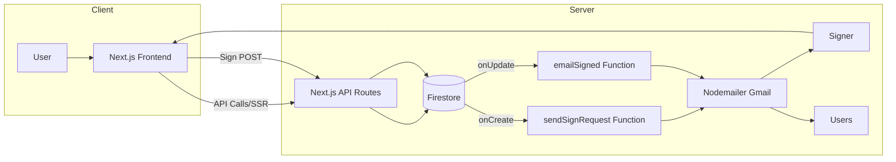
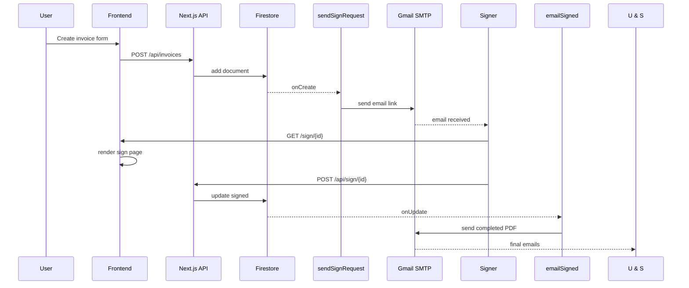
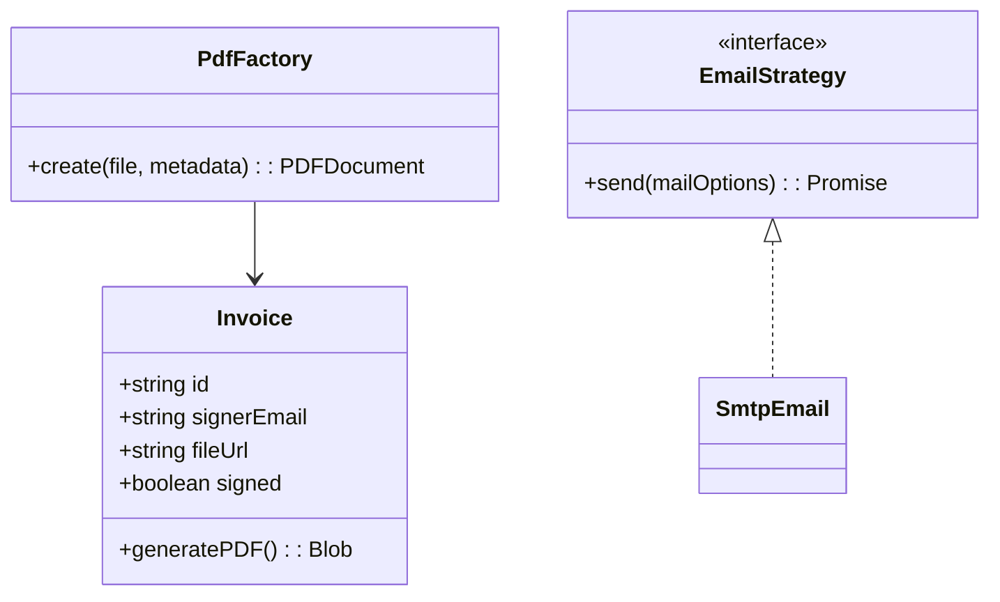

# DocuSign-Style Invoice Signature App

---

## 📋 Table of Contents

1. [Project Link](#project-link)
2. [Project Overview](#project-overview)
3. [What I Built](#what-i-built)
4. [Technology Rationale](#technology-rationale)
5. [Architecture & Design](#architecture--design)
6. [Design Patterns](#design-patterns)
7. [Folder Structure](#folder-structure)
8. [Flowchart](#flowchart)
9. [Diagrams](#diagrams)
10. [Pseudocode Snippets](#pseudocode-snippets)
11. [Installation & Setup](#installation--setup)
12. [Environment Variables](#environment-variables)
13. [Development Workflow](#development-workflow)
14. [Deployment](#deployment)
15. [License](#license)

---

## 1. Project Link

* **GitHub Repo:** [https://github.com/Big-Mojos-Projects/income-sign](https://github.com/Big-Mojos-Projects/income-sign)
* **Live Demo:** [https://income-sign.vercel.app](https://income-sign.vercel.app)

## 2. Project Overview

This application implements a streamlined invoice signing workflow: users can create signature requests, sign invoices via secure email links, and manage sent/signed documents through a unified dashboard.

## 3. What I Built

* **Next.js App Router** with three main views: Create Invoice, Pending Signatures, Signed Documents.
* **Firebase Auth** (Email/Password & OAuth) for user management.
* **PDF Upload & Storage**: invoice files stored in Firebase Cloud Storage.
* **Firestore Data Model**: `documents` collection tracks invoices, status, and file URLs.
* **Cloud Functions**:

  * `sendSignRequest`: Firestore trigger sending email links via Nodemailer.
  * `emailSigned`: HTTPS endpoint with dynamic CORS to email completed PDFs.
* **Email Transport**: Gmail SMTP, credentials via `functions.config()`.
* **Dynamic Domain Handling**: environment-driven CORS origin for localhost/production.
* **UI**: Tailwind CSS + shadcn/ui for accessible, responsive components.
* **Error Handling**: structured logging in functions and client alerts.

## 4. Technology Rationale

| Tech            | Role             | Why Chosen                                                    |
| --------------- | ---------------- | ------------------------------------------------------------- |
| Next.js 15      | Framework        | App Router, SSR/SSG, built-in optimizations, TypeScript first |
| TypeScript      | Language         | Static typing, better tooling, fewer runtime errors           |
| Firebase Auth   | Auth             | Quick setup, social providers, secure JWT                     |
| Firestore       | Database         | Real-time updates, schema flexibility                         |
| Cloud Functions | Serverless Logic | Event-driven, integrates with Firestore and Storage           |
| Cloud Storage   | Asset Storage    | High availability, CDN-enabled                                |
| Nodemailer      | Email            | Simple SMTP API, serverless-compatible                        |
| Vercel          | Hosting & CI/CD  | Zero-config Next.js deploys, preview URLs                     |
| Tailwind CSS    | Styling          | Utility-first, rapid prototyping, consistent design           |

## 5. Architecture & Design



## 6. Design Patterns

* **Factory**: `PdfFactory` selects/upload strategy per document type.
* **Strategy**: `EmailStrategy` interface for SMTP or third-party implementations.
* **Observer (Pub/Sub)**: Firestore triggers observe collection changes.
* **Singleton**: Single Firebase Admin instance per Function runtime.
* **Repository**: Data access abstraction in `src/lib/repository`.

## 7. Folder Structure

```
repo-root/
├── src/
│   ├── app/                # Next.js App Router files
│   ├── components/         # UI components (Forms, Tables)
│   ├── hooks/              # useAuth, useInvoices, etc.
│   ├── lib/
│   │   ├── models/         # TS interfaces & classes
│   │   ├── services/       # Firebase/Storage wrappers
│   │   ├── pdfFactory.ts   # Factory for PDF handling
│   │   └── emailStrategy.ts# Abstraction for sending email
│   └── styles/             # Tailwind & global CSS
├── functions/
│   ├── src/
│   │   ├── cors.ts         # CORS config
│   │   ├── email.ts        # Transport setup & templates
│   │   └── index.ts        # Function entrypoint
│   └── package.json        # Function deps & build scripts
├── .env.local              # Local env vars (ignored)
├── next.config.js          # Aliases & env config
├── firebase.json           # Emulator & hosting rules
├── package.json            # Root scripts & deps
└── vercel.json (opt)       # Vercel build config
```

## 8. Flowchart

Visualizes full invoice lifecycle:



## 9. Diagrams

### Class Diagram



### Component Diagram

```mermaid
flowchart TB
  subgraph Frontend
    A[CreateInvoicePage] --> B[InvoiceForm]
    B --> C[FileUploader]
    B --> D[RecipientSelect]
    E[SignPage] --> F[PdfViewer]
  end
  subgraph Backend
    G[/api/invoices] --> H[Firestore]
    I[sendSignRequest] --> J[Nodemailer]
  end
  A --> G
  S-->E
```

## 10. Pseudocode Snippets

**Create Invoice API** (`src/app/api/invoices/route.ts`):

```ts
export async function POST(req) {
  const { recipient, file } = await req.json();
  const id = uuid();
  const url = await uploadToStorage(file, `invoices/${id}.pdf`);
  await firestore.collection('documents').doc(id).set({ id, recipient, fileUrl: url, signed: false });
  return NextResponse.json({ link: `/sign/${id}` });
}
```

**Cloud Function** (`functions/src/index.ts`):

```ts
export const sendSignRequest = functions.firestore
  .document('documents/{id}')
  .onCreate(snap => {
    const data = snap.data();
    const link = `${functions.config().app.domain}/sign/${data.id}`;
    return transporter.sendMail({ to: data.signerEmail, html: `<a href="${link}">Sign</a>` });
  });
```

## 11. Installation & Setup

1. **Clone**: `git clone https://github.com/Big-Mojos-Projects/income-sign.git`
2. **Install**: `npm install`
3. **Emulate** (optional): `firebase emulators:start --only firestore,functions`
4. **Dev**: `npm run dev` → [http://localhost:3000](http://localhost:3000)

## 12. Environment Variables

```bash
NEXT_PUBLIC_FIREBASE_API_KEY=...
NEXT_PUBLIC_FIREBASE_AUTH_DOMAIN=...
NEXT_PUBLIC_FIREBASE_PROJECT_ID=...
FUNCTIONS_DOMAIN=https://income-sign.vercel.app
```

## 13. Development Workflow

* Feature branches: `feat/INV-123-description`
* Conventional Commits
* CI checks: lint, type-check, tests

## 14. Deployment

* **Next.js** on Vercel: auto-deploy from `main`
* **Functions** via Firebase CLI: `firebase deploy --only functions`
* Set prod env-vars in Vercel & `functions.config()`

## 15. License

MIT © Your Name
